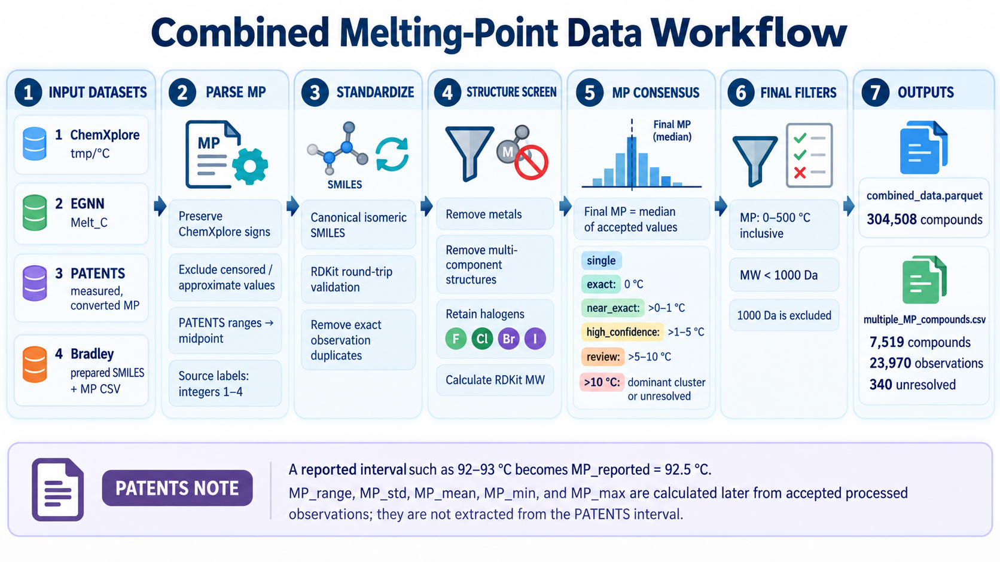

# Combined melting-point data

This directory contains the preparation, combination, and exploratory-analysis
workflow for the four-source melting-point dataset.

The active combined-data pipeline is:

1. optionally reconstruct Source 4 with `data_preparation.ipynb`;
2. combine and curate all four sources with `combine_data_process.ipynb`;
3. read the final files from `outputs/`.



> **Diagram note:** the diagram remains useful as a conceptual overview, but it
> predates the consolidated Source 4 input and the integrated molecular-weight
> filter. “Test + train CSVs” describes Source 4 provenance; the combination
> notebook now reads one prepared Source 4 CSV. The historical compound count
> printed in the diagram is superseded by the current counts reported below.

## Active organization

```text
0_data/
├── README.md
├── data_preparation.ipynb
├── combine_data_process.ipynb
├── source_distribution_overlap_EDA.ipynb
├── data_combining_process_diagram.png
├── input_datasets/
│   ├── 1_ChemXplore_tmpC_Marimuthu_2025.csv
│   ├── 2_EGNN_mp_Huang_2025.csv
│   ├── 3_PATENTS_ochem_Tetko_2016.parquet
│   └── 4_Bradley_Austermeier_2025.csv
└── outputs/
    ├── combined_data.parquet
    └── multiple_MP_compounds.csv
```

A publication-ready `input_datasets/source_manifest.csv` should also be added
to record the original filenames/paths, download locations, retrieval dates,
licenses, and checksums. It is a provenance record and is not generated by the
combination notebook.

The active combination notebook does not read `original_curated/`,
`data_process.ipynb`, or any root-level copy of
`multiple_MP_compounds.csv`. Those are legacy or upstream preparation
artifacts. The authoritative audit output is
`outputs/multiple_MP_compounds.csv`.

The current `source_distribution_overlap_EDA.ipynb` still contains the former
`sources/` path and historical executed results. Update it to the
`input_datasets/` and `outputs/` layout before treating a new execution as
reproducible under this organization.

## Input datasets

| Source | Active input file | SMILES field | MP field used |
|---:|---|---|---|
| 1 | `input_datasets/1_ChemXplore_tmpC_Marimuthu_2025.csv` | `SMILES` | `tmp/ºC` |
| 2 | `input_datasets/2_EGNN_mp_Huang_2025.csv` | `SMILES` | `Melt_C` |
| 3 | `input_datasets/3_PATENTS_ochem_Tetko_2016.parquet` | `SMILES` | `Melting Point {measured, converted}` |
| 4 | `input_datasets/4_Bradley_Austermeier_2025.csv` | `SMILES` | `MP` |

Source numbers are stable integer provenance labels. They refer to the studies
below, not train/test assignments for this project's future models.

### Source publications

| Source | Publication | DOI |
|---:|---|---|
| 1 | *Machine Learning Pipeline for Molecular Property Prediction Using ChemXploreML* | [10.1021/acs.jcim.5c00516](https://doi.org/10.1021/acs.jcim.5c00516) |
| 2 | *Multi-Conformation Enhanced Equivariant Graph Neural Network: Advancing Melting Point Prediction Accuracy for Organic Small Molecules* | [10.1021/acsomega.5c04588](https://doi.org/10.1021/acsomega.5c04588) |
| 3 | *The Development of Models to Predict Melting and Pyrolysis Point Data Associated with Several Hundred Thousand Compounds Mined from PATENTS* | [10.1186/s13321-016-0113-y](https://doi.org/10.1186/s13321-016-0113-y) |
| 4 | *Prediction of Melting Points of Chemicals with a Data Augmentation-Based Neural Network Approach* | [10.1021/acsomega.5c00205](https://doi.org/10.1021/acsomega.5c00205) |

## Preparing Source 4

`data_preparation.ipynb` creates:

`input_datasets/4_Bradley_Austermeier_2025.csv`

It reads:

- all ten non-augmented training-fold CSVs under
  `original_curated/train_without_data_augmentation/`;
- `original_curated/test_predictions/consensus_without_data_augmentation.csv`.

Only `SMILES` and experimental MP values are retained. The test file's
`exp MP` field is renamed to `MP`. Prediction columns and augmented training
files are not used.

The ten validation folds are not appended. They represent the cross-validation
partitions of the same training pool; the notebook verifies that they introduce
no raw SMILES absent from the union of the ten training files.

Source 4 preparation removes exact duplicate `SMILES`–`MP` pairs but
preserves different MP values reported for the same raw SMILES. Canonicalization
and MP consensus are intentionally deferred to `combine_data_process.ipynb`.

The current prepared Source 4 file contains:

| Metric | Count |
|---|---:|
| SMILES–MP observations | 19,609 |
| Unique raw SMILES | 19,588 |
| Raw SMILES retaining multiple distinct MPs | 21 |
| Exact duplicate SMILES–MP pairs remaining | 0 |

If `original_curated/` is not distributed publicly, users can still reproduce
the four-source combination from the prepared Source 4 CSV. Reconstructing that
CSV from the study's original files requires obtaining those files separately
and placing them at the paths documented above. The source manifest should
record where they came from and any redistribution restrictions.

## Reproducing the combined outputs

Open `combine_data_process.ipynb`, restart the kernel, and run all cells in
order. The notebook validates the four filenames and required columns before
processing, creates `outputs/` if necessary, and overwrites:

- `outputs/combined_data.parquet`;
- `outputs/multiple_MP_compounds.csv`.

The molecular-weight calculation and strict `MW < 1000` filter are part of the
main pipeline. There is no longer a separate post-processing cell that rewrites
the Parquet file.

At the time of this README update, the files already present in `outputs/`
still reflect an earlier Source 4 snapshot (303,897 final compounds). A fresh
isolated execution with the four inputs currently in `input_datasets/` passed
all validations and produced 304,508 final compounds. Run the complete
combination notebook once to synchronize the saved outputs. The result tables
below report that fresh current-input execution.

The workflow contains no random operations. With unchanged input files,
notebook code, and software behavior, rerunning it reproduces the same logical
rows, values, ordering, source lists, and audit contents. Parquet bytes or file
hashes can still differ across pandas/PyArrow versions because serialization
metadata and compression encodings can change.

The environment used for the current validated execution was:

- Python 3.11.13
- pandas 2.3.1
- NumPy 2.3.1
- PyArrow 23.0.0
- RDKit 2025.03.6

## Combination and curation workflow

1. Load `SMILES` and the source-specific MP field and assign integer
   `Source` labels 1–4.
2. Parse ChemXplore from the original `tmp/ºC` field. This preserves negative
   signs lost in some `Processed tmp/ºC` values. Numeric values with
   parenthetical uncertainty retain the central value; censored or approximate
   forms such as `<`, `>`, and `≈` are excluded.
3. Convert strict numeric PATENTS intervals to their midpoint. For example,
   `92–93` becomes `MP_reported = 92.5`. Other nonnumeric values are
   excluded.
4. Convert each structure to an RDKit canonical isomeric SMILES and require that
   the canonical result parse successfully a second time.
5. Calculate RDKit average molecular weight with
   `Descriptors.MolWt` from the round-tripped canonical structure.
6. Remove metal-containing structures and structures containing anything other
   than one RDKit molecular fragment. Retain halogen-containing compounds.
7. Remove repeated observations with the same canonical SMILES, numeric MP,
   source label, and source file.
8. Group observations by canonical SMILES and resolve compatible MPs.
9. Omit unresolved compounds from the final Parquet, while retaining their
   observations in the multiple-MP audit.
10. Retain consensus MP values from 0 to 500 °C, inclusive.
11. Retain only structures with `MW < 1000` Da. A value equal to 1000 Da is
    excluded.
12. Write both outputs once, then run schema and chemistry validation checks.

Canonicalization preserves specified stereochemistry. It does not perform
tautomer standardization, neutralization, salt stripping, or stereoisomer
merging.

“Multi-component” means that `Chem.GetMolFrags` identifies anything other
than one molecular fragment, commonly represented by a dot in a SMILES. This
filter therefore excludes mixtures, salts, and other disconnected records.
Metal filtering uses the explicit element set in the notebook. F, Cl, Br, I,
At, and Ts are treated as halogens and retained.

All duplicate comparisons, spreads, medians, and quality tiers use parsed,
unrounded numeric MP values. Thus `100` and `100.0` are identical, while
nearby values are not collapsed by decimal rounding.

### PATENTS range clarification

Only a PATENTS interval's midpoint enters the cross-source consensus. The
interval endpoints are not carried forward as replicate observations and do not
directly determine `MP_mean`, `MP_std`, `MP_mad`, `MP_min`,
`MP_max`, or `MP_range`.

Those fields are calculated later from the accepted processed observations for
the canonical compound. The original PATENTS text remains available as
`MP_raw` only when that observation belongs to a group represented in the
multiple-MP audit.

## MP consensus

For each canonical SMILES:

- one available observation uses `single_measurement`;
- when the complete MP spread is at most 10 °C, all observations are accepted
  and `median_all` is used;
- when the complete spread exceeds 10 °C, a `dominant_cluster` is accepted
  only if it spans no more than 5 °C, contains at least two observations from
  at least two source labels, and represents at least two-thirds of all
  observations;
- otherwise the compound is `unresolved`.

Candidate dominant clusters are prioritized by: (1) greatest number of distinct
sources, (2) greatest number of observations, and (3) smallest spread.

The final `MP` is always the median of the accepted observations. The mean is
reported separately in `MP_mean`. The median is used as the primary consensus
because it is less sensitive to a remaining extreme observation and does not
assume that repeated source values form a normally distributed sample.

### MP quality tiers

Quality is based on the spread of the accepted observations:

| `MP_quality` | Meaning |
|---|---|
| `single` | One accepted observation from one source |
| `exact` | Multiple accepted observations with identical numeric MPs |
| `near_exact` | Spread greater than 0 and no more than 1 °C |
| `high_confidence` | Spread greater than 1 and no more than 5 °C |
| `review` | Spread greater than 5 and no more than 10 °C |
| `unresolved` | No acceptable consensus; audit only |

These are agreement tiers, not measurement-accuracy guarantees.

## Output: `combined_data.parquet`

This is the final broad-organic, single-component consensus dataset. Every row
has a unique canonical isomeric SMILES, consensus MP from 0–500 °C inclusive,
and `MW < 1000` Da.

| Column | Meaning |
|---|---|
| `SMILES` | Canonical isomeric SMILES validated by an RDKit round trip. |
| `MP` | Median of the accepted MP observations, in °C. |
| `Source` | Sorted unique source labels supporting the accepted consensus, stored as Parquet `list<int8>`. Exact agreement across datasets therefore retains multiple integers. |
| `MP_mean` | Arithmetic mean of accepted MP observations. |
| `MP_std` | Sample standard deviation of accepted observations using `ddof=1`; missing for one observation. |
| `MP_mad` | Median absolute deviation from `MP`. |
| `MP_min` | Minimum accepted MP observation. |
| `MP_max` | Maximum accepted MP observation. |
| `MP_range` | `MP_max - MP_min` for accepted observations. |
| `N_MP_values` | Number of accepted observation rows. Identical values from different sources count separately. |
| `N_distinct_MP` | Number of distinct numeric MPs among accepted observations. |
| `N_sources` | Number of unique source labels supporting the consensus. |
| `MP_quality` | `single`, `exact`, `near_exact`, `high_confidence`, or `review`. |
| `Consensus_method` | `single_measurement`, `median_all`, or `dominant_cluster`. |
| `Has_excluded_values` | Whether observations were excluded when selecting a dominant cluster. |
| `N_excluded_values` | Number of observations excluded from the accepted consensus. |
| `All_MP_range` | Spread across all observations before dominant-cluster exclusions. |
| `ContainsHalogen` | Whether the canonical structure contains F, Cl, Br, I, At, or Ts. |
| `MW` | RDKit average molecular weight; not monoisotopic exact mass. |

`Source` records accepted supporting sources. If an observation is rejected as
an outlier during dominant-cluster selection, its source is not included unless
another accepted observation from that source remains.

### Validated result with the current inputs

| Metric | Count |
|---|---:|
| Resolved compounds before final MP/MW filters | 307,386 |
| Removed outside 0–500 °C | 2,704 |
| Removed with `MW >= 1000` after MP filtering | 174 |
| Final compounds | **304,508** |
| Halogen-containing compounds retained | 123,975 |

The retained MW range is 18.015–997.694 Da.

| Quality | Compounds |
|---|---:|
| `single` | 94,754 |
| `exact` | 203,921 |
| `near_exact` | 3,209 |
| `high_confidence` | 2,221 |
| `review` | 403 |

## Output: `multiple_MP_compounds.csv`

This is an observation-level audit for canonical compounds with more than one
distinct numeric MP after structure processing. It contains both resolved and
unresolved groups. Exact MP agreement across sources is not included because
there is no numeric disagreement.

| Column | Meaning |
|---|---|
| `SMILES` | Canonical isomeric SMILES shared by the observation group. |
| `MP_reported` | Parsed numeric MP; PATENTS intervals appear as their midpoint. |
| `MP_raw` | Original source text before parsing. |
| `Source` | One integer source label for this observation row. |
| `Source_file` | Active input filename containing the observation. |
| `Accepted_for_consensus` | Whether this observation contributed to the accepted consensus. All values are `False` for unresolved groups. |
| `MP_quality` | Accepted quality tier or `unresolved`. |
| `Consensus_method` | `median_all`, `dominant_cluster`, or `unresolved`. |
| `Group_MP_range` | Complete maximum-minus-minimum spread before exclusions. |

The audit is created before the final 0–500 °C and `MW < 1000` filters.
Therefore, a resolved group can appear in the audit without appearing in the
final Parquet. It is not a complete log of all MP-range or MW exclusions because
it contains only compounds with multiple distinct MPs.

The fresh current-input validation produced:

| Metric | Count |
|---|---:|
| Observation rows | 23,970 |
| Canonical compounds | 7,519 |
| Unresolved canonical compounds | 340 |
